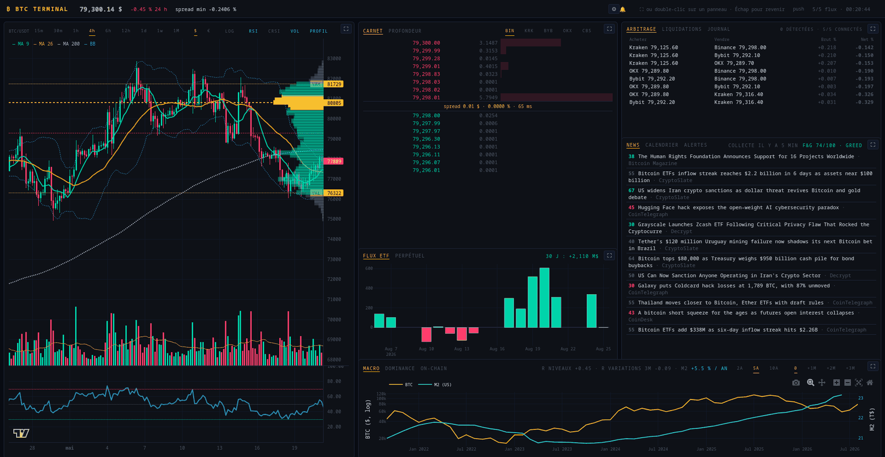
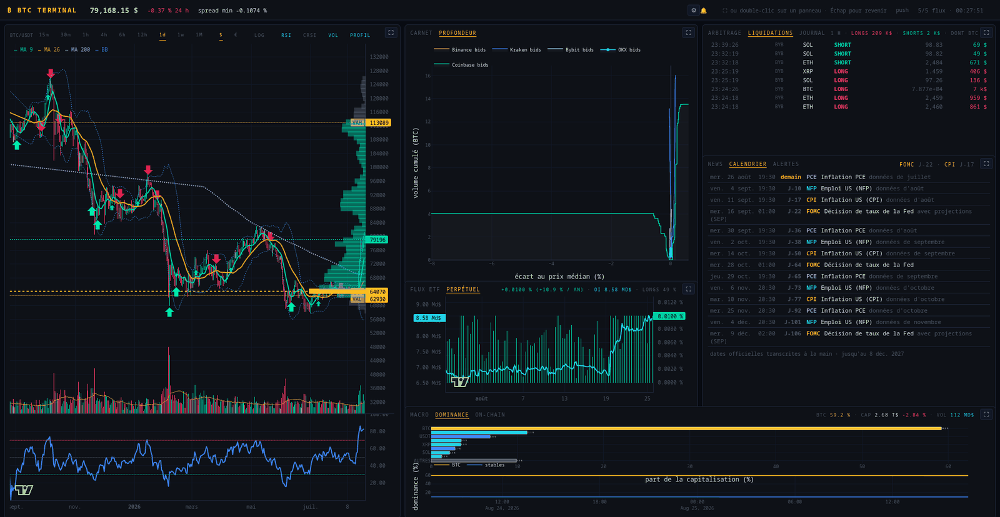
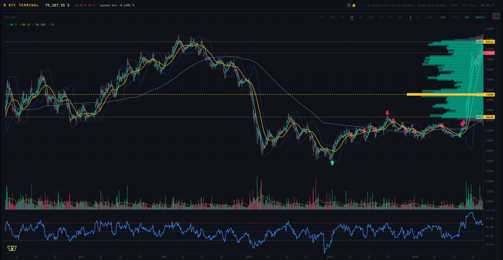
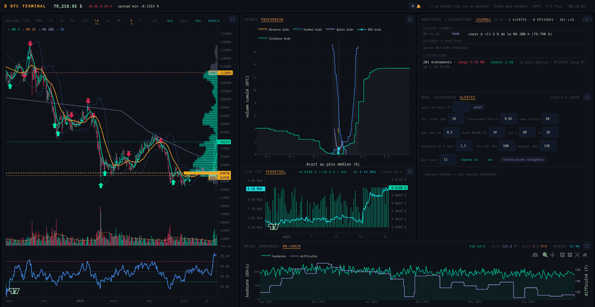

# 🪙 BTC Terminal

**Objectif du projet : construire une sorte de terminal Bloomberg orienté
Bitcoin** — un poste de travail unique regroupant, sur des panneaux
synchronisés, tout ce qu'il faut pour lire le marché : prix et indicateurs
techniques, carnets d'ordres et profondeur multi-exchange, opportunités
d'arbitrage, liquidations, flux des ETF spot, marché perpétuel, news à impact
et sentiment, calendrier macro, dominance, données on-chain et contexte
monétaire — le tout sous alertes configurables.

## Aperçu



*La grille par défaut — chandeliers Lightweight Charts avec moyennes, Bollinger
et profil de volume, carnet Binance en direct, écarts d'arbitrage entre cinq
plateformes, flux des ETF spot, fil de news scoré, cours contre masse
monétaire.*



*Les mêmes cellules, autres onglets — profondeur cumulée des cinq carnets,
liquidations Binance et Bybit, financement et open interest du perpétuel,
calendrier macro, dominance.*



*Un panneau en plein écran d'un clic (ou d'un double-clic), Échap pour
revenir ; ici le prix en 4 h avec ses signaux gradués et le profil de volume
de la plage visible.*



*Le journal relit la séance — alertes sonnées, épisodes d'arbitrage, bilan
des liquidations —, les seuils d'alerte se règlent dans le terminal, et la
chaîne (hashrate, difficulté, mempool) a son onglet.*

Captures produites par `tests/ui_smoke.py --capture` et
`tests/ui_captures.py` sur un terminal en marche, réduites à 1600 px.

**Démo à manipuler** — le panneau prix se dessine entièrement dans le
navigateur : il est servi en page statique, sur un instantané figé, à
**https://stefan-cambodia.github.io/btcterm/** — zoom, crosshair, pan vers
le passé (l'historique se charge en glissant), bascule $/€, échelle log,
panes RSI/CRSI, profil de volume de la plage visible. Mille bougies par
intervalle, datées dans le bandeau ; rien n'y est en direct. La page se
regénère par `python -m terminal.demo docs` (voir « Outils
complémentaires »).

## Lancement

```bash
btcterm                   # ou : python -m terminal.app
```

→ **http://127.0.0.1:8050**

À distance, par tunnel SSH (le port n'est pas exposé sur le réseau) :

```bash
ssh -L 8050:localhost:8050 <machine>
```

En continu — un service utilisateur systemd qui sert le terminal par
gunicorn, journal et alertes couvrant alors la séance entière sans
navigateur ouvert : gabarit dans `terminal/systemd_service.conf`, fabrique
dans `terminal/wsgi.py` (`pip install -e '.[serve]'`).

## Les panneaux

| Panneau | Contenu | Rafraîchissement |
|---|---|---|
| **Prix** | chandeliers de 15 m à 1 M, MA 9/26/200, Bollinger, POC + Value Area, signaux, bascule `$`/`€`, échelle log, sous-graphiques optionnels, historique chargé au pan | bougie en temps réel (push), repli 2 s |
| **Carnet** | 8 niveaux de chaque côté, spread, âge du flux, choix de la plateforme | 250 ms |
| **Profondeur** | profondeur cumulée des 5 plateformes superposées, recentrées en % du prix médian (onglet du carnet) | 250 ms |
| **Arbitrage** | écarts inter-plateformes nets de frais, triés par rentabilité | 250 ms |
| **Liquidations** | positions fermées de force — Binance, toutes paires, et Bybit, dix grandes paires —, totaux de l'heure, fenêtre relue du journal au démarrage (onglet de l'arbitrage) | 250 ms |
| **Journal** | relecture des 24 h : alertes sonnées, épisodes d'arbitrage, bilan des liquidations (onglet de l'arbitrage) | 2 s |
| **Flux ETF** | entrées/sorties nettes des ETF spot ; en plein écran, cumul depuis le lancement, classement des émetteurs et fenêtre réglable (30 j / 90 j / 1 an / tout) | 5 min |
| **Perpétuel** | financement, open interest (prolongé par le journal) et part des comptes longs, sur canvas LWC (onglet des flux ETF) | 5 min |
| **News** | fil scoré + indice Fear & Greed, dont la courbe sur 90 jours en plein écran | 2 s en lecture, collecte toutes les 15 min |
| **Calendrier** | prochaines échéances macro — FOMC, CPI, NFP, PCE — avec compte à rebours (onglet des news) | 5 min |
| **Alertes** | sonneries et réglages : seuils de cours, rafale de liquidations, financement extrême, news à fort score, écart d'arbitrage, écart à la MA 200, RSI extrême, signal gradué fort, glissement de dominance, jour de flux ETF, réseau chargé (onglet des news) | 2 s |
| **Macro** | cours contre masse monétaire M2 (US), décalage réglable et corrélations | 5 min |
| **Dominance** | parts de capitalisation et leur tendance journalisée, cap totale et volume 24 h (onglet de la macro) | 5 min |
| **On-chain** | hashrate et difficulté sur un an, rythme des blocs, mempool (onglet de la macro) | 5 min |

Les **liquidations** sont le pendant du perpétuel : quand une position à levier
ne couvre plus sa marge, la plateforme la ferme au marché, et ces fermetures
arrivent par rafales qui expliquent une partie des mèches du graphique. Le flux
est épisodique — plusieurs minutes de silence ne signalent aucune panne, et le
panneau distingue un flux coupé d'un marché calme.

Le **perpétuel** se lit avec le carnet : le taux de financement est le loyer que
les longs paient aux shorts toutes les huit heures, l'open interest mesure la
taille des positions ouvertes. Un financement élevé sur un open interest qui
gonfle décrit un marché endetté d'un seul côté — la configuration d'où sortent
les liquidations en cascade.

**Onglets** — une cellule peut héberger plusieurs panneaux, choisis par les
onglets posés à la place du titre. Par défaut, cinq cellules en portent :
carnet et profondeur, flux ETF et perpétuel, news avec calendrier et
alertes, macro et dominance et on-chain — plus l'arbitrage, qui partage sa
place avec les liquidations et le journal. Un panneau caché n'est pas dans la page — il ne coûte rien, et il
se remplit dès qu'on l'affiche.

**Push** — les panneaux à 250 ms ont deux canaux : quand le navigateur tient
un WebSocket ouvert sur `/push`, le serveur pousse le rendu à 100 ms et
l'horloge est coupée ; sinon — ou dès que la connexion tombe — l'interrogation
reprend, sans rien casser. Le bandeau affiche le canal en vigueur (« push » ou
« poll »). C'est ce qui garde le carnet vif sur un tunnel SSH lointain, où
chaque aller-retour HTTP paie la latence.

**Disposition** — le **⚙** du bandeau ouvre un dialogue où chaque panneau se
range dans la cellule de son choix : un sélecteur par panneau, donc aucun moyen
d'en perdre un ni de l'afficher deux fois ; seule une cellule vidée de tout est
refusée. Plusieurs panneaux rangés ensemble se partagent la cellule par
onglets. « Par défaut » remplit le formulaire du rangement d'origine —
« Appliquer » reste le seul geste qui écrit. La disposition survit au
rechargement, comme le reste des réglages.

**Plein écran** — trois façons d'agrandir un panneau :

- le **⛶** en haut à droite du panneau,
- un **double-clic** n'importe où dessus (sauf sur un graphique, qui garde
  le double-clic pour réinitialiser ses axes),
- puis `Échap` ou un second clic pour revenir à la grille.

Cliquer le ⛶ d'un autre panneau bascule directement de l'un à l'autre.

Les panneaux s'adaptent à la place disponible :

- le **cours** domine le graphique : les oscillateurs cochés vivent dans
  leurs propres panes, en bas, et tout ce qu'on décoche rend sa hauteur au
  cours — jusqu'à **100 %** si l'on décoche tout ;
- le **carnet** affiche 8 niveaux de chaque côté dans la grille, 20 en plein
  écran.

**Intervalles** — `15m` `30m` `1h` `4h` `6h` `12h` `1d` `1w` `1M`, à la casse
Binance : `m` pour les minutes, `M` pour le mois. Chacun a sa profondeur
d'historique — de quoi nourrir la MA 200 en intraday, sans tirer trente ans de
bougies mensuelles. La case `LOG` passe l'axe des prix en
logarithmique — indispensable dès qu'on remonte plusieurs années, où une
progression de 4 000 à 80 000 dollars écrase tout le début du graphique.

**Sous-graphiques optionnels** — les cases `RSI` · `CRSI` · `VOL` · `PROFIL` de
la barre de titre du panneau prix décident de ce qui accompagne les chandeliers.
Tout ce qu'on décoche rend sa hauteur au cours. Par défaut : RSI, volume et
profil de volume ; le CRSI est disponible mais masqué.

Le graphique conserve zoom et pan pendant que les données coulent — c'est ce qui
permet d'analyser une zone sans être recadré à chaque tour d'horloge. Les
réglages, eux, survivent au rechargement de la page : intervalle, devise,
échelle, sous-graphiques, plateforme du carnet, fenêtre et décalage macro,
l'onglet actif de chaque cellule et la disposition de la grille sont conservés
dans le navigateur (localStorage). Seul le plein écran ne revient pas :
recharger rend la grille.

**Rendu du prix** — le panneau prix dessine sur canvas dans le navigateur,
en [Lightweight Charts](https://tradingview.github.io/lightweight-charts/)
(vendoré, aucun CDN) : crosshair aimanté, ligne du dernier prix, bougie
courante mise à jour en temps réel par le canal push, historique antérieur
chargé à la volée quand on remonte le graphique, profil de volume recalculé
sur la plage visible. Le serveur ne sert que des données (`/api/klines`,
`/api/profile`) et reste la seule source de vérité des indicateurs. Le
panneau perpétuel dessine de la même façon (`/api/perp`) — financement en
histogramme signé, open interest en ligne — ; les autres panneaux sont des
figures Plotly.

**Hors ligne** — si Binance est injoignable au démarrage, le panneau prix sert
une série de démonstration générée localement plutôt qu'un cadre vide, et le
signale par un bandeau orange : les chiffres affichés ne sont alors pas réels.

**Depuis un pays qui bloque les exchanges** — certains fournisseurs d'accès
(au Cambodge, par exemple) ne refusent pas `api.binance.com`, `stream.bybit.com`
ou `ws.okx.com` : leur résolveur DNS y répond `127.0.0.1`, et le terminal
tombe sur la démo sans qu'aucune erreur ne le dise. Le hub pose au démarrage
une résolution de secours (`btcterm/resolver.py`) : dès qu'un nom public
résout en adresse de bouclage, il est redemandé à un résolveur DNS sur HTTPS
joint par son adresse IP (1.1.1.1, puis 8.8.8.8) — et les connexions
partent vers les vraies adresses. Rien à configurer ; un avertissement
`résolution empoisonnée pour …` dans le journal signale chaque nom sauvé.

Le remède de fond est de faire de même pour tout le système, ce qui vaut
aussi pour le navigateur et les outils en ligne de commande. Avec
systemd-resolved, un fichier suffit :

```ini
# /etc/systemd/resolved.conf.d/dns-over-tls.conf
[Resolve]
DNS=1.1.1.1#cloudflare-dns.com 1.0.0.1#cloudflare-dns.com 9.9.9.9#dns.quad9.net
FallbackDNS=8.8.8.8#dns.google
DNSOverTLS=yes
Domains=~.
```

puis `sudo systemctl restart systemd-resolved` ; `resolvectl query
api.binance.com` doit alors rendre une adresse publique. Le DNS sur TLS
empêche le fournisseur d'intercepter les requêtes vers ces résolveurs.

Une restriction ne se contourne pas ainsi : Binance ne livre **aucune donnée
sur ses flux WebSocket futures** (`fstream.binance.com`) depuis certains
pays — la connexion s'ouvre, l'abonnement est acquitté, rien n'arrive. C'est
pourquoi le fil des liquidations écoute aussi **Bybit** (canal
`allLiquidation`, dix grandes paires) : les deux plateformes nourrissent le
même panneau, chaque ligne dit la sienne (`BIN`/`BYB`), et le badge nomme le
lien qui manque — comme celui qui tient sans rien livrer depuis plus d'un
quart d'heure (« Binance muet depuis 22 min »). Le panneau perpétuel (REST
`fapi`) n'est pas concerné.

**News** — le terminal **remplit** lui-même `~/.btc_news/news.db`, toutes les
quinze minutes, avec les règles de scoring du tracker : plus besoin du timer
systemd pour avoir un fil vivant. La barre de titre du panneau donne l'âge de la
dernière collecte, et le nombre d'articles qu'elle a rapportés.

```bash
python -m terminal.app --no-news                 # laisser la base au tracker
CRYPTOPANIC_API_KEY=… python -m terminal.app     # ajouter CryptoPanic aux RSS
```

**Journal** — les données qui mouraient avec le processus sont désormais
journalisées dans `~/.btcterm/journal.db` (30 jours de rétention) : chaque
liquidation, et chaque épisode d'arbitrage rentable — ouvert quand une paire
devient rentable, clos quand elle a cessé de l'être, une ligne par épisode
avec le meilleur profit observé. S'y ajoutent, toutes les cinq minutes, les
**instantanés de marché** (dominance, capitalisation, open interest,
financement) que leurs API refusent de servir en série ; leur rétention est de 400 jours, et
leur accumulation donne au panneau dominance sa tendance et au perpétuel un
financement et un open interest qui remontent au-delà des trente jours de
Binance. La séance se
relit après coup — dans le terminal même (panneau JOURNAL, onglet de
l'arbitrage) ou à la ligne de commande :

```bash
python -m btcterm.journal --heures 6             # relire la séance
python -m terminal.app --no-journal              # s'en passer
```

**Alertes** — le terminal sait attirer l'attention quand on ne le regarde
pas : seuils de cours posés depuis le panneau ALERTES (le sens — au-dessus,
au-dessous — est figé à la pose, avec hystérésis de réarmement), rafale de
liquidations, financement extrême, news à fort score, écart d'arbitrage —
plus trois règles relatives lues sur la bougie horaire close : écart du
cours à sa MA 200, RSI hors bornes, signal gradué fort (±2), muettes sur la
série de démonstration hors ligne — une neuvième assise sur l'historique
journalisé : le glissement de la dominance BTC sur 24 h, qui ne peut sonner
qu'une fois l'historique accumulé — et deux lues sur les panneaux ETF et
on-chain : un jour de flux ETF au-delà du seuil (une sonnerie par jour,
le jour présent au démarrage tenu pour vu) et un réseau chargé, mempool
gonflé ou blocs lents.
Les règles sonnent sur le front montant, sous délai de garde — une condition
qui dure ou qui clignote ne sonne pas en rafale. La cloche du bandeau compte
la dernière heure et ouvre le panneau d'un clic, où qu'il soit rangé ; le bip et les notifications navigateur (permission
demandée d'un clic) retentissent même panneau replié ; chaque sonnerie part
au journal et se relit avec la séance. Les seuils survivent au rechargement
et réarment le moteur au chargement de la page.

**Macro** — le panneau du bas confronte le cours à la masse monétaire M2 des
États-Unis (série H.6 de la Fed, mensuelle). Le sélecteur `+1M` … `+3M` décale
M2 vers l'avant pour éprouver l'idée d'un cours qui suivrait la liquidité avec
un trimestre de retard ; les deux corrélations affichées disent ce qu'il en est.
Celle des **niveaux** est toujours forte et n'apprend rien — deux séries qui
montent depuis dix ans vont ensemble ; celle des **variations sur trois mois**
est la seule qui informe.

**Calendrier** — les prochaines échéances qui font bouger le marché : décisions
du FOMC (avec ou sans projections), inflation CPI et PCE, rapport sur l'emploi
(NFP), chacune avec son compte à rebours et son heure locale. Aucune API
publique satisfaisante n'existe pour ces dates ; elles sont transcrites à la
main dans `btcterm/macrocal.py` depuis les calendriers officiels (la Fed publie
les siennes deux ans à l'avance, l'OMB celles des statistiques fédérales un an).
Le pied du panneau dit jusqu'où court la liste, et prévient quand elle
s'épuise — un calendrier qui se tait parce qu'il est périmé doit se voir.

## Architecture

- **`btcterm/`** — le socle : indicateurs, carnets et connecteurs WebSocket,
  moteur d'arbitrage, collecteurs REST, base de news partagée avec le tracker,
  et le hub qui n'ouvre qu'une connexion par plateforme pour tous les panneaux.
- **`terminal/`** — l'application Dash : grille, thème, figures, panneaux,
  rendus Lightweight Charts du prix et du perpétuel (`lwc.py`,
  `assets/lwc-price.js`, `assets/lwc-perp.js`).

Détail complet dans [`ARCHITECTURE.md`](ARCHITECTURE.md), feuille de route en
[§7](ARCHITECTURE.md#7-feuille-de-route-vers-le-terminal).

**Où en est le projet** — le terminal couvre le prix et ses indicateurs, le
carnet, la profondeur comparée, l'arbitrage, les liquidations, les flux ETF, le
marché à terme, les news, le calendrier macro, la dominance, la chaîne et le
contexte macro : la couverture visée par la feuille de route est atteinte. Les
scripts qu'il remplace ont été supprimés — la TUI d'arbitrage, doublon du
panneau du même nom, en dernier — et ceux qui restent (export ETF, tracker
de news) ne font double emploi avec aucun panneau. Les dernières retouches
viennent de l'usage plutôt que de la feuille de route : la cloche du bandeau
ouvre le panneau alertes d'un clic, la fenêtre des liquidations est relue
du journal au démarrage, un panneau vide après un redémarrage se lisant comme
une panne du flux, le badge des liquidations nomme le lien qui tient sans
rien livrer, Bybit portant seul le panneau là où Binance se tait, et le
service s'arrête en une seconde au lieu d'expirer sous SIGKILL — gunicorn
attendait la fin des WebSockets, qui n'en ont pas. Le journal de séance a
aussi révélé des « arbitrages » de plusieurs heures à prix figé : un niveau
fantôme dans un carnet nourri par deltas. Les carnets se resynchronisent
désormais quand ils se croisent, et le moteur les écarte en attendant. Et
la machine qui dort n'est plus passée sous silence : le panneau journal
compte les interruptions de séance, et les courbes journalisées s'y
rompent au lieu de tirer un trait par-dessus. Enfin, les alertes de la
journée sont relues au démarrage comme les liquidations : un service
relancé n'affiche plus « aucune alerte » après une nuit qui a sonné. Et
une source REST qui tombe se lit dans `journalctl` — première panne,
rétablissement, durée — au lieu de laisser des trous muets dans
l'historique : l'instantané journalisé n'écrit que des valeurs fraîches.
Ce même journal a ensuite compté cinquante-quatre resynchronisations
Kraken en une matinée, et nommé la cause qu'on croyait fortuite : le flux
décrit une fenêtre de vingt-cinq niveaux, le carnet en gardait cent, et
ce que Kraken cesse de suivre devient fantôme — le carnet est désormais
borné à sa fenêtre.

## Outils complémentaires

### La démo statique — `python -m terminal.demo docs`

Fige un paquet `/api/klines` par intervalle (mille bougies, indicateurs
compris) dans `docs/demo/data/`, copie le rendu Lightweight Charts et sa
bibliothèque depuis `terminal/assets/`, et écrit `docs/index.html` : la page
que GitHub Pages sert depuis `docs/`. Le navigateur y remplace le serveur —
`docs/demo/shim.js` détourne `fetch` vers les paquets figés, pagine par
`time` comme `terminal/lwc.py`, et recalcule le profil de volume ;
`tests/test_demo.py` vérifie sous Node que ce remplaçant dit la même chose
que l'original. À relancer après tout changement de `lwc-price.js`, ou pour
rafraîchir l'instantané ; le tout passe par le résolveur de secours, donc
fonctionne aussi là où le DNS ment.


Ce que le terminal ne couvre pas garde sa ligne de commande : l'export des
flux ETF et le tracker de news, tous deux bâtis sur le socle. Les quatre
scripts que le terminal a remplacés — `btc-dash.py`, `btc_dashboard2.py`,
`btc-liquidity.py`, `btc_orderbook_live.py` — ont été supprimés, de même
qu'`etf.py`, doublon antérieur d'`etf_bitcoin_flows.py`, `m2supply.html`,
page tronquée que le panneau macro remplace, et `arbitrage/main.py`, la TUI
qui n'était qu'une autre façade du moteur du panneau ARBITRAGE.

> Données de marché : APIs publiques (Binance, Kraken, Coinbase, Bybit, OKX) —
> **aucune clé API n'est requise**, aucun ordre n'est jamais passé.

---

## Table des outils

| Outil | Type | Sources | Lancement |
|---|---|---|---|
| `terminal/` | Terminal web (Dash) | REST + WebSockets, 5 plateformes | `btcterm` (ou `python -m terminal.app`) → http://127.0.0.1:8050 |
| `etf_bitcoin_flows.py` | CLI | farside.co.uk (scraping) | `python etf_bitcoin_flows.py --days 90` |
| `news/btc_news.py` | CLI + SQLite | RSS, CryptoPanic, Fear & Greed | `python news/btc_news.py fetch` |

Voir [`ARCHITECTURE.md`](ARCHITECTURE.md) pour le détail interne de chaque module.

---

## Installation

```fish
# Activer le venv existant (fish)
source venv/bin/activate.fish

# Le terminal et sa commande `btcterm`
pip install -e .

# Ou bien : toutes les dépendances du dépôt, sans installer de paquet
pip install -r requirements.txt
```

Le venv présent à la racine (`venv/`, Python 3.14) contient déjà tout, commande
comprise.

`pip install -e .` installe la commande **`btcterm`** avec les seules
dépendances du terminal ; l'extra `cli` (`pip install -e '.[cli]'`) ajoute
celles des outils en ligne de commande, l'extra `serve` celle du service
continu — gunicorn, voir « Lancement ». `requirements.txt` reste la référence
groupée par usage : pour n'installer qu'une partie, il suffit de reprendre le
bloc concerné — le socle `btcterm/` ne demande que `pandas`, `numpy` et
`requests`.

L'installation n'est d'ailleurs pas un prérequis : les scripts trouvent
`btcterm/` par eux-mêmes, où que soit le répertoire courant, et
`python -m terminal.app` lance le terminal sans rien installer.

`news/requirements.txt` reste disponible pour installer le seul tracker, et
`news/setup.fish` crée un venv dédié plus une fonction fish `btcnews`.

### Tests

```bash
python tests/test_indicators_parity.py   # indicateurs identiques à l'origine
python tests/test_news_scoring.py        # scoring et collecte des news
python tests/test_liquidations.py        # lecture du flux de liquidations
python tests/test_orderbook.py           # carnets : niveaux fantômes, fenêtre Kraken, resynchronisation
python tests/test_cache.py               # cache du hub : secours, fraîcheur, pannes dites
python tests/test_macrocal.py            # calendrier macro tenu à la main
python tests/test_terminal_wiring.py     # panneaux posés et branchés
python tests/test_grid_layout.py         # rangement configurable des panneaux
python tests/test_fullscreen_toggle.py   # bascule plein écran (nécessite Node)
python tests/test_push.py                # pousseur WebSocket, sans navigateur
python tests/test_journal.py             # journal : événements, épisodes, rétention
python tests/test_alerts.py              # alertes : seuils, fronts, cadences
python tests/test_wsgi.py                # fabrique gunicorn du régime service
python tests/test_lwc_serialize.py       # contrat de série du rendu du prix
python tests/test_lwc_api.py             # /api/klines : pagination, repli démo
python tests/test_indicators_incremental.py  # dernier point : borné = complet
python tests/test_prepare_price_frame.py # enrichissement du prix : colonnes, bornes
python tests/test_resolver.py            # résolution DNS de secours, sans réseau
python tests/test_fear_greed.py          # Fear & Greed : lecture, dérivation, couleurs
python tests/test_etf_flows.py           # flux ETF : fenêtres, cumul, classement

python -m terminal.app &                 # puis, terminal lancé :
python tests/ui_smoke.py --capture /tmp/captures   # contrôle dans Firefox
python tests/ui_captures.py docs/captures   # captures des onglets secondaires
python tests/test_demo.py                # démo statique : constructeur, shim (Node)
```

Le premier vérifie que les indicateurs du socle produisent exactement les mêmes
valeurs que les implémentations des dashboards d'origine, dont il conserve des
copies conformes — c'est ce qui a permis de supprimer ces scripts sans perdre
la garantie. Le deuxième fait de même pour le scoring des news, extrait du
tracker, et vérifie en prime ce que l'extraction rend enfin testable : la
collecte filtre sous le seuil et n'insère pas deux fois le même article.

Le troisième lit un flux de liquidations au format documenté par Binance sans
toucher au réseau — ce flux étant épisodique, le contrôle Firefox trouve presque
toujours le panneau vide, et le sens des événements (une vente forcée ferme une
position longue) mérite mieux qu'une observation chanceuse. Le quatrième garde
le calendrier macro contre ce qui guette une liste de dates tenue à la main : la
faute de frappe silencieuse (aucune publication ne tombe un week-end) et le
décalage d'heure d'été entre New York et l'Europe. Le cinquième vérifie
qu'aucun panneau n'a été écrit puis oublié — ni dans la
grille, ni dans l'enregistrement des callbacks, ni dans la liste des panneaux
qu'une cellule peut afficher, un panneau absent de cette liste n'étant
atteignable par aucun clic. Le sixième éprouve la normalisation du rangement
des panneaux — un localStorage périmé ou altéré ne doit jamais casser le rendu
d'une cellule, le navigateur du contrôle visuel partant, lui, toujours d'un
état sain. Le septième exécute la fonction JavaScript du plein écran sous Node,
faute de quoi elle échapperait à toute couverture. Le huitième contrôle le
pousseur WebSocket sans navigateur : l'état annoncé est traité comme une
entrée hostile, le rendu poussé suit la plateforme et l'agrandissement, et la
sérialisation est stable à données constantes — l'hypothèse dont vivent les
trames différentielles. Le neuvième déroule la vie d'un épisode d'arbitrage
dans le journal au temps simulé — l'épisode ne s'écrit qu'une fois clos, et le
test ne pouvait pas attendre 30 secondes de grâce en temps réel. Le dixième
fait de même pour les alertes — hystérésis d'un seuil de cours, front
montant sous délai de garde, cadence des contrôles coûteux : rien de tout
cela ne se constate en regardant l'écran au bon moment. Le onzième éprouve
la fabrique WSGI du régime service : l'environnement d'une unité systemd
traduit en arguments du hub, le démarrage, l'arrêt confié à `atexit`, la
route `/push` posée — une variable mal lue ne se verrait qu'en production.
Les trois derniers gardent le rendu du prix : le contrat de série que le
navigateur consomme (triée, dédoublonnée, sans NaN), la pagination de
`/api/klines` — sans trou, repli de démonstration avoué par son drapeau —
et la parité du calcul borné des indicateurs, celui qui suit la bougie
courante, avec le recalcul complet. Aucun de ces tests ne touche au réseau.

`ui_smoke.py` est à part : il pilote Firefox pour contrôler ce qui ne se voit
qu'à l'écran — cellules posées, bouton visible et sans recouvrement, bascule
plein écran effective, carnet montrant ses deux côtés, barre de titre du panneau
prix tenant sur une ligne, échelle logarithmique atteignant l'axe, panneau macro
traçant ses deux séries, changement d'onglet remplaçant un panneau par
l'autre, rempli dès son apparition, rechargement de page restaurant onglets
et sélecteurs mais pas le plein écran, canal push pris (badge « push »,
carnet vivant l'horloge coupée, agrandissement acheminé par le WebSocket),
alertes comprises (cloche au bandeau, seuil posé et retiré par ses puces) —
et le dialogue de disposition : un
panneau déménagé arrive dans sa cellule, en repart au rangement d'origine, et
le déménagement survit au rechargement. Il sait déposer des captures, suppose
le terminal déjà lancé (`--url` pour un port d'essai), et s'ignore si Firefox
est absent.

## Les outils en détail

### 1. `etf_bitcoin_flows.py` — Flux des ETF Bitcoin spot

Récupère le tableau public de `farside.co.uk/bitcoin-etf-flow-all-data/`
(flux quotidiens IBIT,
FBTC, GBTC, ARKB, BITB, HODL…) et affiche les N derniers jours en millions
de dollars, plus le flux net cumulé et le décompte des jours entrants/sortants.

```bash
python etf_bitcoin_flows.py                 # 90 derniers jours
python etf_bitcoin_flows.py --days 0        # tout l'historique
python etf_bitcoin_flows.py --csv flows.csv # export CSV complet
```

Ce script avait un doublon, `etf.py`, mouture antérieure qui ne gérait pas les
en-têtes multi-niveaux du site, n'élaguait pas les colonnes vides, passait le
HTML directement à `pd.read_html()` (déprécié) et affichait via
`DataFrame.to_string` au lieu de `tabulate`. Il a été supprimé.

### 2. `news/btc_news.py` — BTC News Tracker

CLI d'agrégation de news à impact sur le cours, stockées dans SQLite
(`~/.btc_news/news.db`). Sources : 6 flux RSS (CoinDesk, CoinTelegraph,
Decrypt, Bitcoin Magazine, The Block, CryptoSlate), l'API CryptoPanic
(optionnelle, clé gratuite) et le Fear & Greed Index.

Chaque article reçoit un **score 0-100** par pondération de mots-clés
(régulation, ETF, Fed, halving, hack, ATH…) ; sous `MIN_SCORE = 30`, il est
écarté. Un sentiment `bullish` / `bearish` / `neutral` est déduit du
vocabulaire (ou des votes CryptoPanic quand ils existent).

```bash
btcnews fetch -v                 # récupérer
btcnews list --min-score 60      # seulement les news importantes
btcnews list --sentiment bearish
btcnews unread                   # non lues, puis marquées lues
btcnews search "etf"
btcnews stats
btcnews watch --interval 30      # boucle de surveillance
```

Le scoring, le schéma et la collecte vivent dans `btcterm/newsdb.py` : ce script
en garde la ligne de commande et l'affichage, le terminal la même base et les
mêmes règles. Le tracker reste utile quand le terminal ne tourne pas — et
`news/systemd_timer.conf` contient (en commentaires, à décommenter et adapter)
les unités systemd `--user` pour un `fetch` automatique toutes les 30 minutes.

---

## Notes

- Le terminal écrit dans `~/.btc_news/news.db` — la base du tracker, mêmes
  règles, mêmes déduplications. `--no-news` l'en dispense.
- Il tient aussi `~/.btcterm/journal.db` — liquidations et épisodes
  d'arbitrage de la séance. `--no-journal` l'en dispense.
- Aucun de ces scripts n'écrit d'ordre sur un exchange ; ils sont en lecture
  seule sur des endpoints publics.
- Le hub contourne de lui-même un résolveur DNS qui empoisonne les noms des
  exchanges (voir « Depuis un pays qui bloque les exchanges ») ; les outils en
  ligne de commande, eux, s'en remettent au DNS du système.
- Le terminal se lie à `127.0.0.1:8050` ; `--host` et `--port` permettent d'en
  changer.
- Le dépôt est versionné avec git (branche `main`, pas de remote).
